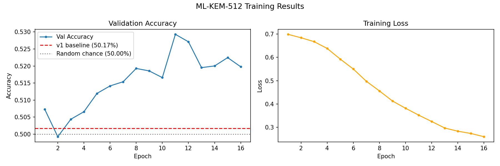
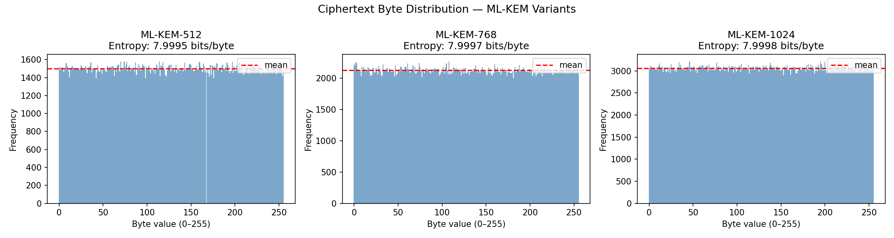
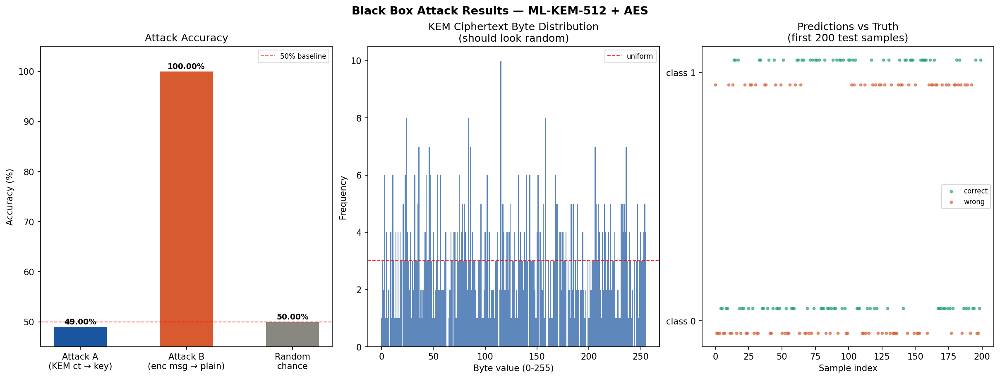

# ML-KEM Statistical Profiling Attack Suite

A research-grade cryptanalysis pipeline evaluating whether machine learning can extract information from ML-KEM (NIST FIPS 203) ciphertexts. This project implements a black-box statistical profiling attack using deep learning on large-scale datasets.


## 🔬 Research Objective
To determine whether ciphertexts generated by ML-KEM contain any learnable statistical structure that allows prediction of secret-derived properties using machine learning.


## 🧠 Hypothesis
A deep neural network trained on bit-sliced ML-KEM ciphertexts can classify a property of the corresponding shared secret at accuracy statistically above the 50% random baseline.


## ❌ Hypothesis Outcome
The hypothesis was not supported. Across all experiments (MLP, PCA+MLP, and 1D ResNet), model performance remained statistically indistinguishable from random guessing (~50%), indicating no learnable structure in ML-KEM ciphertexts under this threat model.


## 🛡️ Threat Model
The attacker is assumed to have:

- Access to the public encapsulation key (ek)  
- Access to a large number of ciphertexts generated under the same key  

The attacker does not have access to the secret key.

**Goal:** Predict a binary property of the shared secret using only ciphertext.

---

## 📊 Results

| Variant | Ciphertext Size | Input Dim | Accuracy | P-value | Significant |
|--------|----------------|----------|----------|---------|------------|
| ML-KEM-512 | 768 bytes | 6144 bits | ~50.4% | 0.30 | ❌ |
| ML-KEM-768 | 1088 bytes | 8704 bits | ~49.9% | 0.56 | ❌ |
| ML-KEM-1024 | 1568 bytes | 12544 bits | ~49.4% | 0.76 | ❌ |

- All results lie within ±0.6% of random baseline (50%)  
- All p-values > 0.05 → not statistically significant  

👉 Conclusion: No exploitable statistical bias detected.


## 📊 Visual Results

### ML-KEM-512 Learning Curve


### Ciphertext Byte Distribution


### Black-box Experiment Output



## 🔑 Key Insight
Despite large-scale training and expressive models, no learnable signal exists in ML-KEM ciphertexts. The outputs behave as computationally indistinguishable from random, supporting the security guarantees of the ML-KEM standard.

---

## ⚙️ Methodology

### Dataset Generation
FIPS 203-compliant ML-KEM implementation (kyber-py)  
100,000 samples per variant  
Fixed public key (profiling attack model)

### Feature Engineering
Ciphertext → bit-level tensor (MSB-first unpacking)  
Input size: 6K–12K bits

### Dimensionality Reduction
PCA → 256 components (fit on training split only)

### Model Architecture
MLP baseline  
PCA + MLP optimized model  
1D ResNet on raw ciphertext bits (**implemented; no significant improvement observed**)

### Label
MSB of first byte of shared secret (balanced binary classification)

### Training
Split: 70 / 15 / 15  
Optimizer: AdamW  
Early stopping applied


## 📈 Evaluation
Accuracy compared to 50% random baseline  
Statistical validation via binomial z-test  
Significance threshold: α = 0.05  

---

## 📂 Project Structure

```
src/generation/ — Dataset generation (FIPS 203 compliant)
src/models/ — Neural network architectures
src/analysis/ — Statistical evaluation tools
src/utils/ — Utilities (bit conversion, etc.)

data/raw/ — Generated datasets (.csv.gz)
data/kat_vectors/ — NIST Known Answer Tests

notebooks/ — Exploratory experiments
results/ — Logs, figures, checkpoints
scripts/ — Automation scripts
```

## 🚀 Quickstart

Install dependencies

```bash
pip install -r requirements.txt
```

Generate dataset (test run)
```bash
bash scripts/generate_datasets.sh 500 100
```

Full dataset generation
```bash
bash scripts/generate_datasets.sh 100000 5000
```

## 📦 Data Format

Each dataset row contains:

ciphertext — hex-encoded ciphertext (input)
shared_secret — hex-encoded shared secret (label source)
ct_bits — input dimension

Example loading
```python
import pandas as pd
import numpy as np
import binascii

def hex_to_bit_tensor(hex_str):
    raw = binascii.unhexlify(hex_str)
    return [(byte >> shift) & 1
            for byte in raw
            for shift in range(7, -1, -1)]

df = pd.read_csv("data/raw/ml_kem_512_100k.csv.gz")
X = np.stack(df["ciphertext"].apply(hex_to_bit_tensor)).astype(np.uint8)
```

---

## ⚠️ Important Note

Ciphertext alone does not leak information in properly designed cryptographic systems. Any apparent success of ML models in similar settings is typically due to:

Data leakage
Improper randomness
Flawed experimental design

This project ensures a clean and valid evaluation setup.

## 🔍 Limitations
Only MSB label tested
PCA may remove nonlinear features
CPU-based training limits model complexity
Single-run experiments (no variance analysis)

## 🔮 Future Work
Alternative labels (parity, byte buckets)
Full dataset training on GPU
Improved architectures
Saliency / interpretability analysis
Multi-run statistical validation

## 📚 References
NIST FIPS 203 — ML-KEM Standard
CRYSTALS-Kyber Specification
kyber-py implementation
Deep Learning Side-Channel Analysis (CHES, SPACE)

## 🏁 Final Conclusion

Machine learning models are unable to extract any meaningful information from ML-KEM ciphertexts. The results confirm that ML-KEM outputs behave as random from an attacker’s perspective, reinforcing the security claims of NIST FIPS 203.

